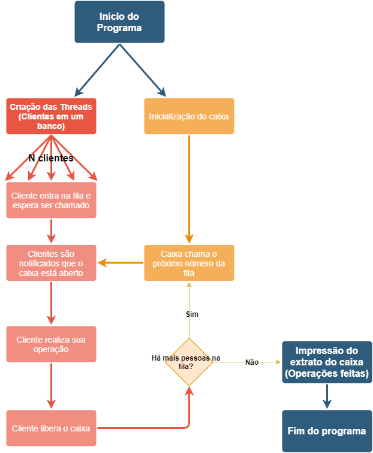
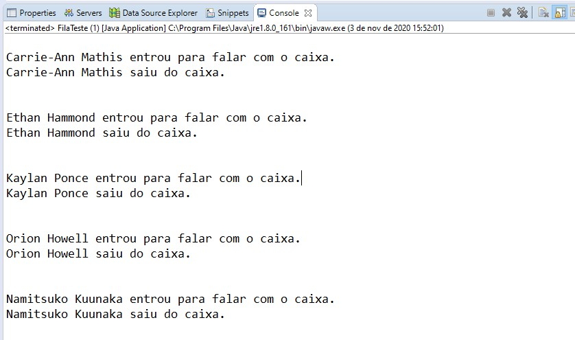
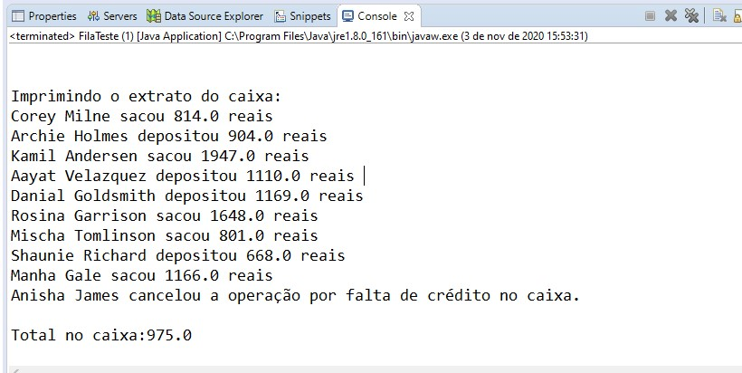

# Prova-CC-6P-PPD-2020-2

## Dupla
- Erick Silva
- Pedro Oliveira
## Descrição
O trabalho se baseia na ideia da criação de um simulador de filas de caixa de banco. Quando o caixa está aberto, ele chama pela próxima senha na lista e os clientes, que estão em espera (wait()) aguardam até serem notificados(notifyall()) da próxima chamada e verificarem se é a senha deles em questão.
- Caso o cliente esteja com a intenção de realizar algum saque, primeiro ocorre a verificação se esse saldo está disponível no caixa, caso esteja, essa operação leva 5 minutos (500ms).
  - Caso o valor de saque desejado não esteja disponível, a operação é cancelada, levando 1 minuto (100ms).
- Caso o cliente esteja com a intenção de realizar algum depósito, a operação leva 10 minutos (1000ms).

## Fluxograma da ideia do trabalho

## Tecnologias usadas:
- Todo o projeto foi feito utilizando a linguagem java, com o uso de Threads, implementação de Runnable e o uso de um arquivo contendo nomes aleatórios para criação de clientes fictícios

## Screenshots da tela
### Screenshot de Entradas
 
- A imagem acima demonstra como o programa responde para com os clientes entrando / saindo do caixa, gerando uma notificação no console visível para o programador

### Screenshot de impressão do extrato

- Simulando um gerente fechando o caixa no fim do expediente, a screenshot acima retrata o que aparece no console, ao final de todos os clientes serem atendidos. Ao final do extrato, também descreve quanto de dinheiro ainda está disponível no caixa.
